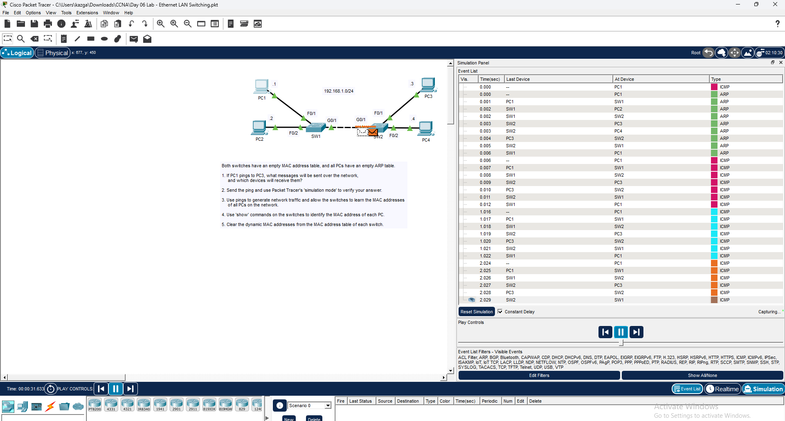
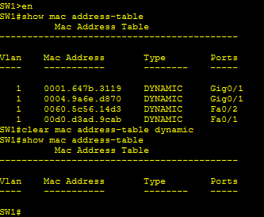
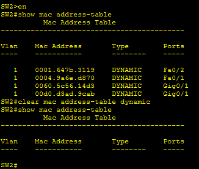

# CCNA Day 6 Lab – Ethernet LAN Switching and MAC Address Table Analysis

---

## Overview

This lab demonstrates how Ethernet LAN switching works at Layer 2 by observing ARP and ICMP traffic flow in Packet Tracer Simulation Mode, reading and analyzing the MAC address tables on two switches after traffic is generated, and clearing dynamic MAC address entries. Starting with empty MAC address tables and empty ARP caches, pings were used to generate traffic and force the switches to learn MAC addresses dynamically through the flooding and learning process.

---

## Environment

| Tool | Purpose |
|------|---------|
| Cisco Packet Tracer | Network simulation and switching behavior observation |
| Cisco Switches (x2) | SW1, SW2 — Ethernet LAN switching |
| PCs (x4) | PC1, PC2, PC3, PC4 — LAN endpoints |
| Simulation Mode | ARP and ICMP traffic capture and analysis |
| GitHub | Documentation and version control |

---

## Network Topology

### Device Connections

| Device | Interface | Connected To | Interface |
|--------|-----------|-------------|-----------|
| PC1 (.1) | — | SW1 | F0/1 |
| PC2 (.2) | — | SW1 | F0/2 |
| SW1 | G0/1 | SW2 | G0/1 |
| PC3 (.3) | — | SW2 | F0/1 |
| PC4 (.4) | — | SW2 | F0/2 |

**Subnet: 192.168.1.0/24**

---

## Lab Tasks and Results

---

### ✅ Task 1 — Predicted Traffic Flow Before Sending Ping

**Question:** If PC1 pings PC3, what messages will be sent over the network and which devices will receive them?

**Answer:**
With empty MAC address tables and empty ARP caches, the following sequence occurs:

1. PC1 does not know PC3's MAC address so it sends an **ARP broadcast** — this floods to all devices on the network (PC2, SW1, SW2, PC3, PC4)
2. PC3 receives the ARP request and sends an **ARP reply** (unicast) back to PC1
3. PC1 now knows PC3's MAC address and sends an **ICMP echo request** (ping)
4. Because SW1 and SW2 have empty MAC tables, the ICMP is initially **flooded** to all ports
5. PC3 receives the ping and sends an **ICMP echo reply** back to PC1
6. Switches learn MAC addresses from each frame and update their tables dynamically

---

### ✅ Task 2 — Sent Ping and Verified in Simulation Mode

Switched Packet Tracer to Simulation Mode and sent a ping from PC1 to PC3. The Event List captured the full ARP and ICMP exchange across all devices — confirming the predicted traffic flow. ARP events appeared first at timestamps 0.000 through 0.006, followed by ICMP events from 0.007 onward — matching the expected sequence of ARP resolution before ICMP forwarding.

*Packet Tracer Simulation Mode — ARP and ICMP events captured across PC1, PC2, PC3, PC4,
SW1, and SW2 confirming flooding and MAC learning behavior*

---

### ✅ Task 3 — Generated Traffic to Populate MAC Address Tables

Sent additional pings between all PCs to allow both switches to learn the MAC addresses of all four endpoints. After traffic was generated, both switches had fully populated dynamic MAC address tables.

---

### ✅ Task 4 — Viewed MAC Address Tables on Both Switches

Ran `show mac address-table` on SW1 and SW2 to confirm all four MAC addresses were learned dynamically.

**SW1 MAC Address Table:**

| VLAN | MAC Address | Type | Port |
|------|-------------|------|------|
| 1 | 0001.647b.3119 | DYNAMIC | Gig0/1 |
| 1 | 0004.9a6e.d870 | DYNAMIC | Gig0/1 |
| 1 | 0060.5c56.14d3 | DYNAMIC | Fa0/2 |
| 1 | 00d0.d3ad.9cab | DYNAMIC | Fa0/1 |

**SW2 MAC Address Table:**

| VLAN | MAC Address | Type | Port |
|------|-------------|------|------|
| 1 | 0001.647b.3119 | DYNAMIC | Fa0/2 |
| 1 | 0004.9a6e.d870 | DYNAMIC | Fa0/1 |
| 1 | 0060.5c56.14d3 | DYNAMIC | Gig0/1 |
| 1 | 00d0.d3ad.9cab | DYNAMIC | Gig0/1 |

*SW1 show mac address-table — 4 dynamic entries learned, then cleared with
clear mac address-table dynamic*

*SW2 show mac address-table — 4 dynamic entries learned, then cleared with
clear mac address-table dynamic*

---

### ✅ Task 5 — Cleared Dynamic MAC Address Entries

Ran `clear mac address-table dynamic` on both switches to remove all dynamically learned entries. Ran `show mac address-table` again to confirm the tables were empty — confirming the clear command worked correctly.

**Commands used:**

SW1#clear mac address-table dynamic

SW1#show mac address-table

SW2#clear mac address-table dynamic

SW2#show mac address-table

Both tables returned empty after clearing — confirmed in the screenshots above.

---

## Key Observations

| Observation | Explanation |
|-------------|-------------|
| ARP before ICMP | Switches and PCs needed to resolve MAC addresses before ICMP could be forwarded |
| Initial flooding | With empty MAC tables, frames were flooded to all ports until MAC addresses were learned |
| Dynamic learning | Switches learned MAC addresses from the source MAC of incoming frames |
| Inter-switch entries | SW1 learned PC3 and PC4 MACs on Gig0/1 — the uplink to SW2 |
| SW2 learned PC1 and PC2 MACs on Gig0/1 — the uplink to SW1 |
| Clear command | clear mac address-table dynamic removes all learned entries immediately |

---

## Skills Demonstrated

| Skill | How It Was Applied |
|-------|--------------------|
| Ethernet Switching Concepts | Observed flooding, learning, and forwarding behavior |
| ARP Analysis | Confirmed ARP broadcast sent before ICMP when MAC unknown |
| Simulation Mode | Captured ARP and ICMP events in real time |
| MAC Address Table | Read and interpreted dynamic entries on both switches |
| Switch CLI | Used show mac address-table and clear mac address-table dynamic |
| Traffic Prediction | Correctly predicted traffic flow before running the simulation |

---

## Lessons Learned

**Switches learn MAC addresses from source frames, not destination frames.** Every time a frame arrives on a switch port, the switch records the source MAC address and the port it arrived on. This is how the MAC address table gets built dynamically. The destination MAC determines where the frame is forwarded — but the source MAC is what teaches the switch.

**Flooding is not a failure — it is the default behavior for unknown destinations.** When a switch receives a frame destined for a MAC address it does not recognize, it floods the frame out all ports except the one it arrived on. This is correct and expected behavior. Once the destination device replies, the switch learns its MAC and future frames are forwarded directly without flooding.

**Inter-switch MAC learning works through uplinks.** SW1 learned the MAC addresses of PC3 and PC4 — which are physically connected to SW2 — on its Gig0/1 uplink port. This is correct because all traffic from PC3 and PC4 arrives at SW1 through that single uplink. In a real network this means a switch may have many MAC addresses associated with a single trunk port.

---

## 💼 Real-World Application

MAC address table analysis is a daily skill for network engineers and help desk technicians troubleshooting Layer 2 connectivity issues. When a device cannot communicate, checking the MAC address table confirms whether the switch has learned the device, which port it is on, and whether it is being flooded. Security teams also monitor MAC address tables to detect MAC spoofing and rogue devices connected to the network. Understanding how switches learn, forward, and flood at Layer 2 is foundational knowledge for every networking and security role.

---

## References

- [Jeremy's IT Lab — CCNA Day 6](https://www.youtube.com/watch?v=9eH16Fxeb9o)
- [Jeremy's IT Lab — Full CCNA Course](https://www.youtube.com/playlist?list=PLxbwE86jKRgMpuZuLBivzlM8s2Dk5lXBQ)
- [Cisco Packet Tracer Download](https://www.netacad.com/courses/packet-tracer)
